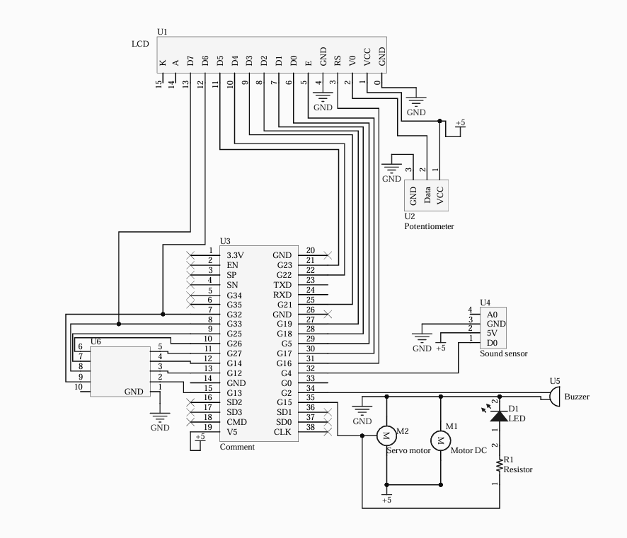

# Projet Carte de Test pour ESP32 (MicroPython)

Ce projet est une carte de test pour évaluer différents composants en utilisant MicroPython sur un microcontrôleur ESP32 WROOM 32.

## Fonctionnalités

- **Écran LCD** : Affiche des messages pendant les tests.
- **Microphone** : Teste le fonctionnement du microphone.
- **LED** : Teste le fonctionnement de la LED.
- **Buzzer** : Joue une mélodie pour vérifier le fonctionnement.
- **Servo Moteur SG90** : Teste le mouvement du servo moteur.
- **Afficheur à Sept Segments** : Affiche un motif de test.

## Matériel Requis

- ESP32 WROOM 32
- Écran LCD
- Microphone
- LED
- Buzzer
- Servo Moteur SG90
- Afficheur à Sept Segments

## Logiciels Requis

- Firmware MicroPython installé sur l'ESP32

## Lancer le projet 

- Cloner ce repositorie
- Transférer tous les fichiers dans l'ESP32
- Brancher un composant sur la carte électronique
- Relancer la carte

